# Sprawozdanie

- Michał Kubicki
- Niestacjonarnie
- 6 Semestr

# Backend projektu (GraphQL)

## 1. Opis ogólny

Backend projektu udostępnia API w technologii **GraphQL** do obsługi aplikacji filmowej (zarządzanie filmami, recenzjami, obsadą, platformami VOD, listą ulubionych i watchlistą). Dane są przechowywane w **SQLite** i mapowane na obiekty za pomocą **TypeORM**.

Aplikacja uruchamia dwa serwery:

- **Apollo Server (GraphQL)** – port **5000**
- **Serwer plików statycznych (obrazy)** – port **5001** (domyślnie), ścieżka `/images`

## 2. Stos technologiczny

- **Node.js + TypeScript**
- **Apollo Server v5** (`@apollo/server`) – warstwa GraphQL
- **TypeORM** – ORM i definicje encji
- **SQLite3** – baza danych w pliku `db.sqlite`
- **bcryptjs** – hashowanie haseł użytkowników
- **jsonwebtoken** – generowanie i weryfikacja JWT
- **express** – serwowanie obrazów (statycznie)
- Narzędzia developerskie: **nodemon**, **concurrently**

## 3. Struktura backendu

Najważniejsze elementy katalogu `backend/src`:

- `index.ts` – start aplikacji (GraphQL + serwer obrazów)
- `data-source.ts` – konfiguracja TypeORM (SQLite, encje, synchronizacja)
- `typeDefs.ts` – definicje schematu GraphQL (typy, Query, Mutation, inputy)
- `entity/` – encje TypeORM (modele bazy danych)
- `resolvers/` – resolvery GraphQL (logika zapytań i mutacji)
- `seed.ts` – przykładowe zasilenie bazy danymi

## 4. Jak uruchomić backend

### Wymagania

- Zainstalowany **Node.js** (zalecana aktualna wersja LTS)
- `npm`

### Instalacja zależności

W katalogu `backend`:

```shell
npm install
```

### Tryb deweloperski (watch)

Kompiluje TypeScript w tle i uruchamia serwer z automatycznym restartem:

```shell
npm run dev
```

### Tryb produkcyjny

Jednorazowa kompilacja i uruchomienie:

```shell
npm run start
```

### Seedowanie (przykładowe dane)

```shell
npm run seed
```

Po seedowaniu w katalogu backendu powstanie/uzupełni się plik bazy `db.sqlite`.

## 5. Konfiguracja (zmienne środowiskowe)

Backend działa bez dodatkowej konfiguracji, ale wspiera:

- `JWT_SECRET` – sekret do podpisywania tokenów JWT (domyślnie: `dev_secret`)
- `IMAGE_PORT` – port serwera obrazów (domyślnie: `5001`)

## 6. Baza danych i TypeORM

Konfiguracja znajduje się w `src/data-source.ts`.

- Baza: `sqlite`, plik `db.sqlite`
- `synchronize: true` – TypeORM automatycznie tworzy/aktualizuje strukturę tabel na podstawie encji przy starcie (wygodne w dev, ostrożnie w produkcji)
- `logging: true` – logowanie zapytań SQL

## 7. Encje (modele danych)

Encje zdefiniowane są w `src/entity/*.ts`.

### Lista encji

- **User** (`users`)
- **Movie** (`movies`)
- **Review** (`reviews`)
- **Watchlist** (`watchlists`)
- **FavoriteMovie** (`favorite_movies`)
- **Actor** (`actors`)
- **MovieCast** (`movie_cast`)
- **Director** (`directors`)
- **Genre** (`genres`)
- **VodPlatform** (`vod_platforms`)
- **Country** (`countries`)
- **Language** (`languages`)

### Kluczowe pola i relacje

- **User**: `userId (uuid)`, `email`, `password (hash)`, dane profilu, `createdAt`
- **Movie**: `movieId (uuid)`, `title`, `slug (unique)`, opisy, `releaseYear`, `durationMinutes`, `averageRating`, `ratingCount`, `isPublished`, `releaseDate`, `createdAt`
  - relacje:
    - `ManyToOne` → **Director**
    - `ManyToOne` → **Country**
    - `ManyToOne` → **Language**
    - `ManyToMany` ↔ **Genre** (tabela łącząca tworzona automatycznie przez `@JoinTable()`)
    - `ManyToMany` ↔ **VodPlatform** (tabela łącząca)
    - `OneToMany` → **Review**
    - `OneToMany` → **MovieCast** (obsada)
- **Review**: `reviewId`, `content`, `rating`, `createdAt`
  - `ManyToOne` → **User**
  - `ManyToOne` → **Movie**
- **MovieCast**: łączy **Movie** i **Actor** + `roleName` (rola w filmie)
- **Watchlist**: pozycja listy do obejrzenia, łączy **User** i **Movie** + `watched`
- **FavoriteMovie**: pozycja ulubionych, łączy **User** i **Movie**

## 8. API – GraphQL

### Endpoint

Serwer GraphQL uruchamiany jest przez `startStandaloneServer` i domyślnie wystawia API pod adresem zwróconym w logach, typowo:

- `http://localhost:5000/`

W tym miejscu dostępna jest również strona testowa (Apollo landing page / Sandbox) do wykonywania zapytań.

### Schemat

Schemat znajduje się w `src/typeDefs.ts` i zawiera:

- typy: `User`, `Movie`, `Director`, `Genre`, `Actor`, `MovieCast`, `Review`, `Watchlist`, `FavoriteMovie`, `Country`, `Language`, `VodPlatform`
- `Query` – pobieranie list i pojedynczych obiektów po `id`
- `Mutation` – rejestracja/logowanie oraz CRUD dla większości encji

### Dostępne Query (przykłady)

- `users`, `user(id)`
- `movies`, `movie(id)`
- `actors`, `actor(id)`
- `directors`, `director(id)`
- `genres`, `genre(id)`
- `reviews`, `review(id)`
- `watchlists`, `watchlist(id)`
- `favoriteMovies`, `favoriteMovie(id)`
- `countries`, `country(id)`
- `languages`, `language(id)`
- `vodPlatforms`, `vodPlatform(id)`

### Dostępne Mutation (przykłady)

- Auth:
  - `register(input: UserInput): AuthPayload`
  - `login(email, password): AuthPayload`
- CRUD:
  - `createMovie / updateMovie / deleteMovie`
  - `createReview / updateReview / deleteReview`
  - analogicznie dla pozostałych encji (Actor/Director/Genre/VodPlatform/Country/Language/MovieCast/Watchlist/FavoriteMovie/User)

## 9. Jak działa logika resolverów (podstawy)

Resolvery są podzielone na pliki per-encja w `src/resolvers/` i złożone w `src/resolvers/index.ts`.

Najważniejsze mechanizmy:

- Każdy resolver korzysta z `AppDataSource.getRepository(Encja)` i wykonuje operacje `find`, `findOne`, `save`, `update`, `delete`.
- Dla złożonych obiektów (np. `Movie`) stosowane jest `relations: [...]`, aby od razu dociągnąć powiązane dane (gatunki, reżyser, recenzje z użytkownikami, platformy VOD, obsada z aktorami itd.).
- **Movie.createMovie** automatycznie tworzy `slug`, jeśli nie został podany (na podstawie `title`).
- **Review.createReview** po zapisaniu recenzji przelicza `averageRating` i `ratingCount` filmu na podstawie wszystkich recenzji w bazie.
- **FavoriteMovie.createFavoriteMovie**:
  - potrafi pobrać `userId` z tokena JWT w nagłówku `Authorization: Bearer <token>` (gdy nie podano `userId` w input)
  - zabezpiecza przed duplikatami (jeśli ulubiony już istnieje, zwraca istniejący rekord)

## 10. Uwierzytelnianie (JWT)

- Rejestracja (`register`) i logowanie (`login`) zwracają `AuthPayload` zawierający `token` i obiekt `user`.
- Hasła są hashowane przy `register` oraz `createUser` za pomocą `bcryptjs`.
- Token JWT podpisywany jest sekretem `JWT_SECRET` i ma ważność `7d`.

Uwaga: poza `createFavoriteMovie` backend nie wymusza globalnie autoryzacji (brak guardów/permissions w resolverach). Ewentualne ograniczenia dostępu należałoby dopisać w resolverach lub w warstwie context/middleware.

## 11. Serwowanie obrazów

W `src/index.ts` uruchamiany jest dodatkowy mini-serwer Express, który wystawia pliki z katalogu:

- `backend/images/`

Adres zasobu:

- `http://localhost:5001/images/<nazwa_pliku>` (port można zmienić przez `IMAGE_PORT`)

Pola typu `posterUrl`, `photoUrl`, `logoUrl`, `avatarUrl` mogą wskazywać na te zasoby (lub na zewnętrzne URL).

## 12. Dane testowe (seed)

Skrypt `seed.ts`:

- czyści część tabel
- tworzy przykładowych użytkowników, reżyserów, gatunki, platformy VOD, kraje, języki, aktorów, filmy, recenzje i obsadę
- przelicza oceny filmów na podstawie recenzji

## 13. Przykładowe zapytania GraphQL

Pobranie listy filmów z relacjami:

```graphql Documentation/Dokumentcja.md
query {
  movies {
    movieId
    title
    averageRating
    director {
      firstName
      lastName
    }
    genres {
      name
    }
    vodPlatforms {
      name
    }
    reviews {
      rating
      content
      user {
        email
      }
    }
    cast {
      roleName
      actor {
        firstName
        lastName
      }
    }
  }
}
```

Logowanie:

```graphql Documentation/Dokumentcja.md
mutation {
  login(email: "alice@example.com", password: "password") {
    token
    user {
      userId
      email
    }
  }
}
```

Dodanie filmu do ulubionych (z tokenem w nagłówku Authorization):

```graphql Documentation/Dokumentcja.md
mutation {
  createFavoriteMovie(input: { movieId: "<MOVIE_UUID>" }) {
    favoriteMovieId
    movie {
      title
    }
    user {
      email
    }
  }
}
```

---

# Frontend projektu (`movie-app`)

## 1. Opis ogólny

Frontend jest aplikacją SPA zbudowaną w oparciu o **Vue 3 + TypeScript + Vite**. Komunikuje się z backendem wyłącznie przez **GraphQL** (Apollo Client) i prezentuje widoki związane z przeglądaniem filmów, szczegółami filmu, aktorami, platformami VOD oraz funkcjami użytkownika (logowanie/rejestracja, ulubione, watchlista, recenzje).

## 2. Stos technologiczny

- **Vue 3** (Single File Components, `<script setup>`) + **TypeScript**
- **Vite** – bundler/dev-server
- **Vue Router** – routing po stronie klienta
- **Apollo Client** + `@vue/apollo-composable` – zapytania/mutacje GraphQL
- **Tailwind CSS** – stylowanie (wspierane przez `postcss` + `autoprefixer`)
- **reka-ui** – prymitywy UI (wykorzystywane w komponentach przycisków/dialogów)
- Dodatkowo: `clsx`, `tailwind-merge` – łączenie klas CSS (helper `cn`)

## 3. Jak uruchomić frontend

### Wymagania

- Node.js + npm
- Uruchomiony backend GraphQL pod `http://localhost:5000/`

### Instalacja i uruchomienie

W katalogu `movie-app`:

```shell
npm install
npm run dev
```

Build produkcyjny:

```shell
npm run build
```

Podgląd buildu:

```shell
npm run preview
```

## 4. Struktura aplikacji

Najważniejsze pliki/katalogi w `movie-app/src`:

- `main.ts` – tworzenie aplikacji, podpięcie routera i wstrzyknięcie klienta Apollo
- `App.vue` – główny layout (Navbar + `<router-view />`)
- `router/index.ts` – definicja tras
- `apollo/client.ts` – konfiguracja Apollo Client (endpoint + nagłówek Authorization)
- `pages/` – widoki aplikacji
- `components/` – komponenty wielokrotnego użycia (np. `layout/Navbar.vue`, `ui/*`)
- `style.css` – Tailwind + zmienne CSS (kolory/tryb dark)

Dodatkowo w `vite.config.ts` ustawiono alias:

- `@` → `./src`

## 5. Routing (widoki)

Routing zdefiniowany jest w `src/router/index.ts`. Najważniejsze ścieżki:

- `/` → **HomePage** (lista filmów + filtrowanie + ulubione)
- `/movie/:id` → **MovieDetails** (szczegóły filmu)
- `/actors` → **ActorsPage**
- `/actor/:id` → **ActorDetails**
- `/vod-platforms` → **VodPlatformsPage**
- `/vod/:id` → **VodPlatformDetails**
- `/favorites` → **FavoriteMoviesPage**
- `/watchlist` → **WatchlistPage**
- `/login` → **LoginPage**
- `/register` → **RegisterPage**

## 6. Komunikacja z backendem (GraphQL + Apollo)

Konfiguracja znajduje się w `src/apollo/client.ts`:

- endpoint GraphQL: `http://localhost:5000/`
- do każdego requestu dodawany jest nagłówek:
  - `Authorization: Bearer <token>`
- token jest pobierany z `localStorage` (`localStorage.getItem("token")`)

W komponentach/stronach używane są:

- `useQuery(...)` – pobieranie danych (listy filmów, aktorów, platformy, detale)
- `useMutation(...)` – operacje modyfikujące (logowanie, rejestracja, tworzenie filmu, dodawanie ulubionych, watchlista, recenzje)

## 7. Uwierzytelnianie po stronie frontendu

- Po `login`/`register` aplikacja zapisuje w `localStorage`:
  - `token`
  - `userId` (jeśli backend zwróci)
- Aplikacja wysyła event `auth-change` na `window`, aby np. **Navbar** mógł natychmiast odświeżyć stan zalogowania.
- W kilku miejscach, gdy `userId` nie jest dostępne, aplikacja próbuje odczytać je z payloadu JWT (ręczne `atob(...)` i parsowanie JSON).

## 8. Najważniejsze funkcjonalności per widok

### 8.1 HomePage (strona główna)

- Pobiera listę filmów (`movies`) oraz listę gatunków (`genres`).
- Obsługuje filtrowanie po:
  - tytule (search)
  - gatunku
  - roku produkcji
  - minimalnej ocenie
- Obsługuje dodawanie/usuwanie filmu z ulubionych:
  - query: `favoriteMovies`
  - mutacje: `createFavoriteMovie`, `deleteFavoriteMovie`

### 8.2 MovieDetails (szczegóły filmu)

- Pobiera szczegóły filmu po `id` z trasy.
- Prezentuje:
  - dane filmu (opis, rok, czas, ocena)
  - reżysera, gatunki
  - obsadę (cast) wraz z rolami
  - platformy VOD (logo + nazwa)
  - trailer (osadzanie YouTube w `iframe` lub link zewnętrzny)
- Funkcje użytkownika:
  - ulubione (toggle)
  - watchlista (dodaj/usuń + oznacz jako „watched”)
  - dodanie recenzji (rating 1–5 + treść), a następnie `refetch()` detali filmu

### 8.3 ActorsPage / ActorDetails

- Lista aktorów z wyszukiwarką po imieniu i nazwisku.
- Widok szczegółów aktora zawiera biogram, datę urodzenia oraz listę filmów (na podstawie `movieRoles`).

### 8.4 VodPlatformsPage / VodPlatformDetails

- Lista platform VOD z liczbą dostępnych filmów.
- Szczegóły platformy pokazują jej filmy oraz pozwalają przejść do detali filmu.

### 8.5 FavoriteMoviesPage

- Pobiera `favoriteMovies` i filtruje je tylko do aktualnego użytkownika (na podstawie `userId` z JWT).

### 8.6 WatchlistPage

- Pobiera `watchlists` i filtruje do aktualnego użytkownika.
- Umożliwia:
  - przejście do szczegółów filmu
  - oznaczenie pozycji jako „watched”
  - usunięcie z watchlisty

### 8.7 Navbar (nawigacja + akcje)

- Zawiera linki do głównych widoków.
- Jeżeli użytkownik nie jest zalogowany – pokazuje przycisk **Login**.
- Jeżeli użytkownik jest zalogowany – pokazuje:
  - przycisk **+ New Movie** (dialog z formularzem i mutacją `createMovie`)
  - przycisk **Logout** (czyści `localStorage` + event `auth-change`)

## 9. Warstwa UI i stylowanie

- UI jest budowane na komponentach z `src/components/ui/*` (m.in. `Button`, `Card`, `Dialog`, `Input`, `Textarea`).
- Tailwind jest skonfigurowany w `tailwind.config.js` i opiera się o zmienne CSS (kolory, promień zaokrąglenia) w `src/style.css`.
- W kodzie często stosowany jest helper `cn(...)` (`src/lib/utils.ts`) do łączenia klas Tailwind.

### 10.1 Home (lista filmów)

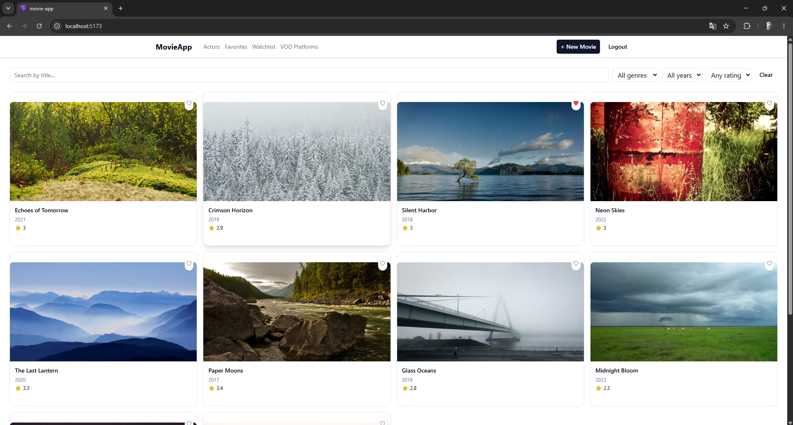

### 10.2 Logowanie

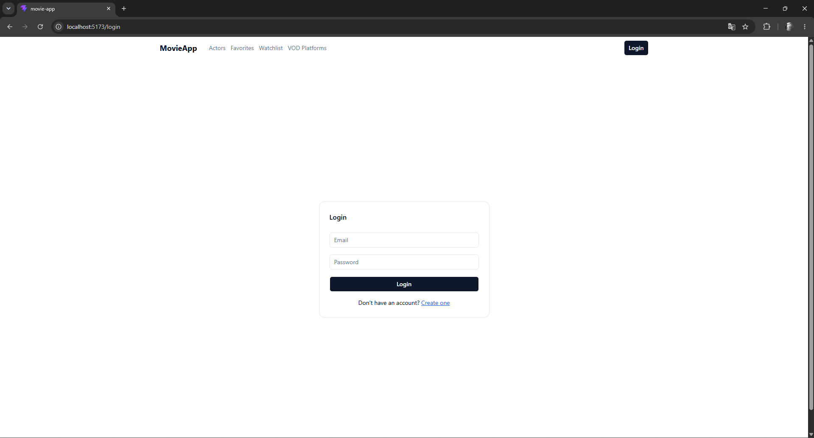

### 10.3 Rejestracja

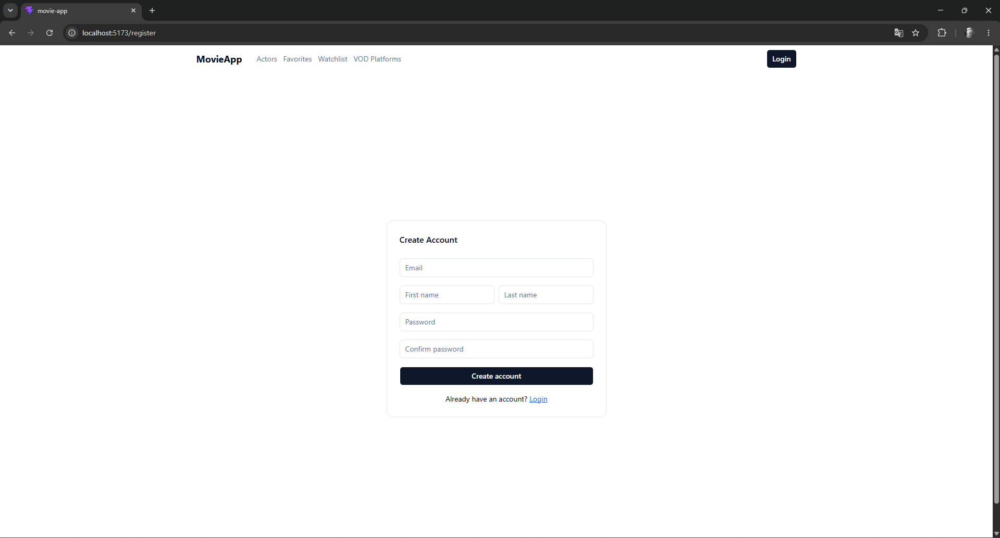

### 10.4 Szczegóły filmu

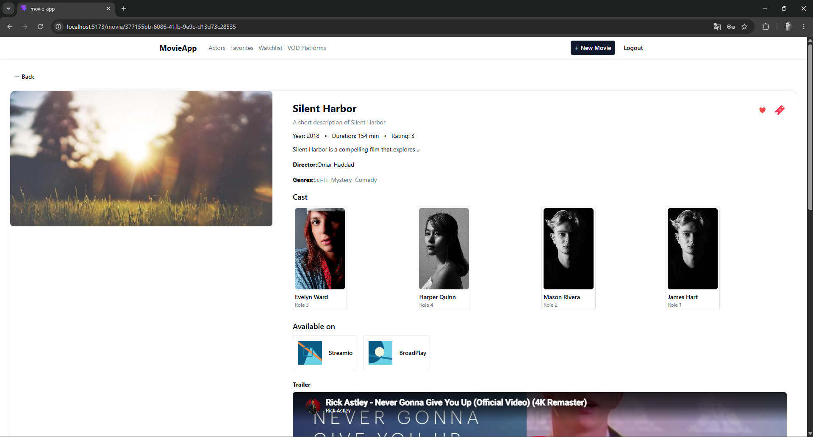
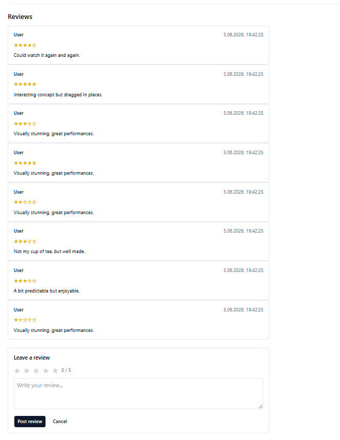

### 10.5 Aktorzy (lista)

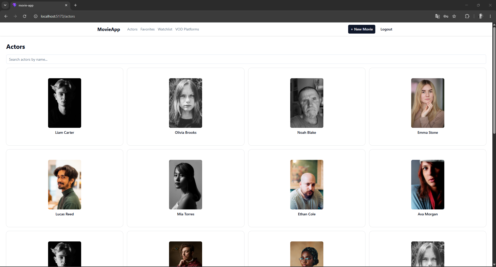

### 10.6 Szczegóły aktora

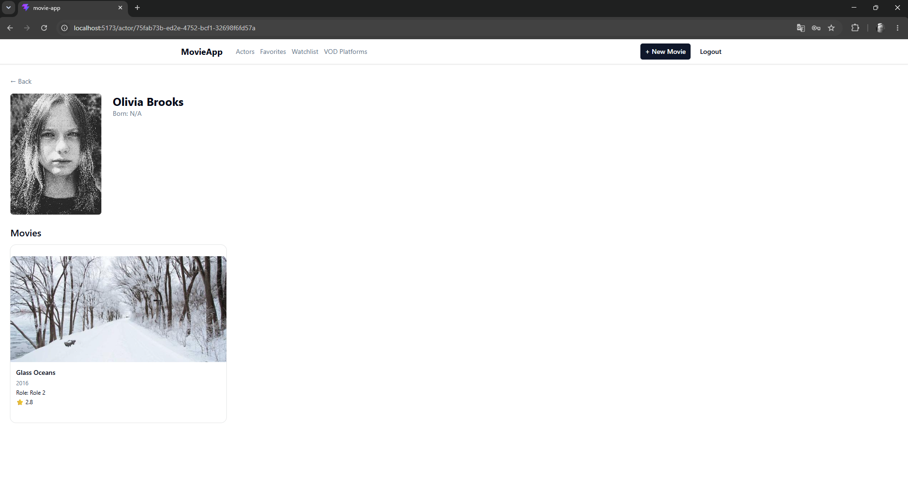

### 10.7 Platformy VOD (lista)

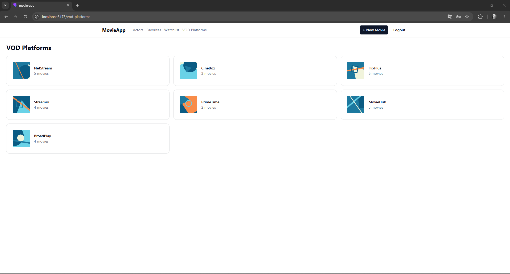

### 10.8 Szczegóły platformy VOD

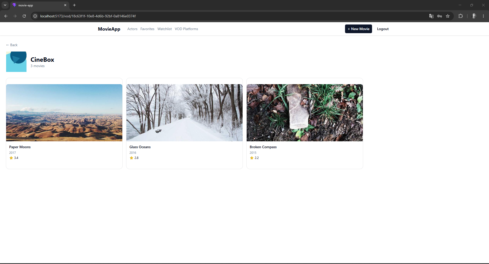

### 10.9 Ulubione

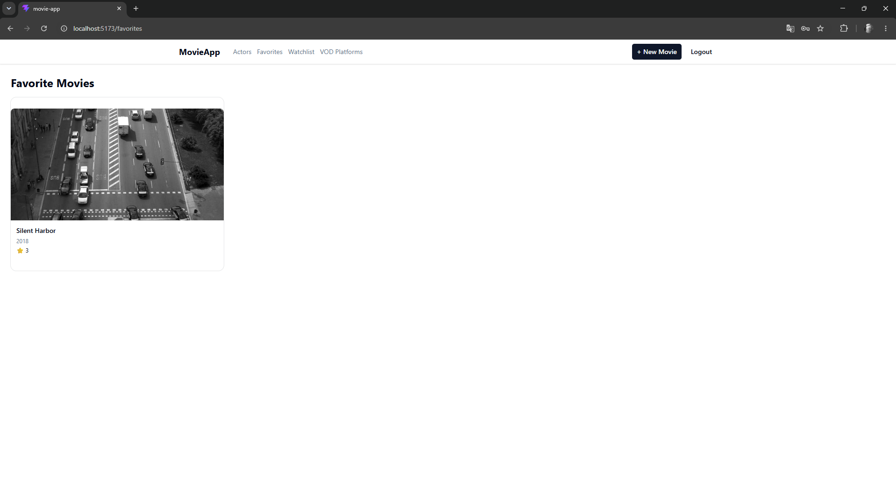

### 10.10 Watchlista

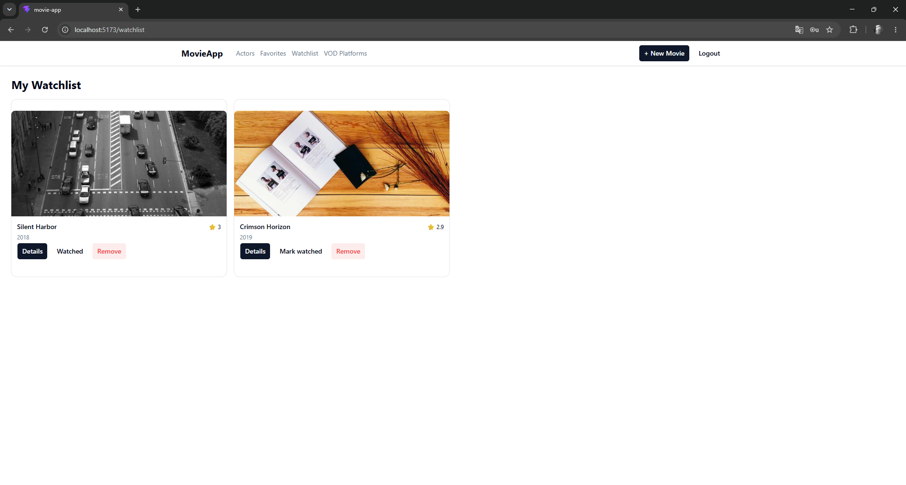
